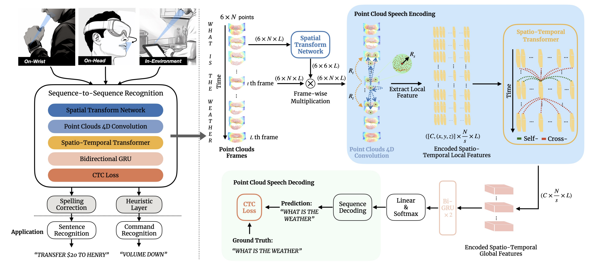

# WatchYourMouth: Silent Speech Recognition with Depth Sensing

<div>
    <h4 align="center">
        <a href="】https://dl.acm.org/doi/10.1145/3613904.3642092" target='_blank'>
        
        </a>
        <a href="https://youtu.be/wm8CLepJaCg?si=H_7jVMJLF64Cmuf8" target='_blank'>
        
        </a>
<!--         <a href="https://huggingface.co/spaces/sczhou/ProPainter" target='_blank'>
        
        </a> -->
    </h4>
</div>

## Introduction
Silent speech recognition is a promising technology that decodes human speech without requiring audio signals, enabling private human-computer interactions. In this paper, we propose Watch Your Mouth, a novel method that leverages depth sensing to enable accurate silent speech recognition. By leveraging depth information, our method provides unique resilience against environmental factors such as variations in lighting and device orientations, while further addressing privacy concerns by eliminating the need for sensitive RGB data. We started by building a deep-learning model that locates lips using depth data. We then designed a deep learning pipeline to efficiently learn from point clouds and translate lip movements into commands and sentences. We evaluated our technique and found it effective across diverse sensor locations: On-Head, On-Wrist, and In-Environment. Watch Your Mouth outperformed the state-of-the-art RGB-based method, demonstrating its potential as an accurate and reliable input technique.

## To-Do List

- [x] Code Release
- [ ] Tutorial Document (eta may 30)
- [ ] Dataset Release


## References
Here are some great resources we benefit:
- P4Transformer: https://github.com/hehefan/P4Transformer
- Point Spatio-Temporal Transformer: https://github.com/hehefan/PST-Transformer
- PointNet: https://github.com/charlesq34/pointnet
- PointNet++: https://github.com/charlesq34/pointnet2
- LipNet-Pytorch: https://github.com/VIPL-Audio-Visual-Speech-Understanding/LipNet-PyTorch

## Citation
If you find our work useful in your research, please consider citing:
```
@inproceedings{wang2024watch,
  title={Watch Your Mouth: Silent Speech Recognition with Depth Sensing},
  author={Wang, Xue and Su, Zixiong and Rekimoto, Jun and Zhang, Yang},
  booktitle={Proceedings of the CHI Conference on Human Factors in Computing Systems},
  pages={1--15},
  year={2024}
}
```
